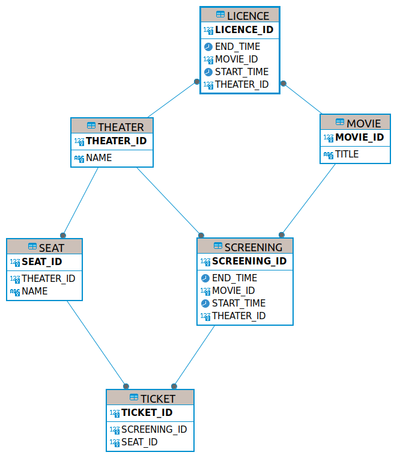

# TASK
## The main objective
The main objective of this project is to provide the implementation of a backend
service in Java which exposes a REST API or uses a message broker and is used
by some other services for booking online movie tickets. Booking a ticket means
just blocking the required number of particular seats.

## Requirements
  * The service should expose the following endpoints:
  * View all playing movies
  * Select a movie
  * See all theaters showing the movie
  * Select a theater
  * See available seats (e.g., a1, a2, a3) for the selected theater & movie.
  * You can assume that all theaters have 20 seats capacity.
  * Book one or more of the available seats. Service should be able to handlemultiple requests simultaneously (no over-bookings)

## EXPECTATIONS:
  * Clean, well-documented source code.
  * At least 50% unit-test coverage.
  * Documented APIs (REST, broker messages etc) for the consumer.
  * You are allowed to use third-party libraries whenever deemed suitable.
  * Docker support

## Other resources used during modeling and to refine requirements
  * [Movie_theater wikipedia](https://en.wikipedia.org/wiki/Movie_theater)
  * [film-copyright-licensing](https://www.independentcinemaoffice.org.uk/advice-support/what-licences-do-i-need/film-copyright-licensing/)

# Compile and Run

The project use:

  * Java 17
  * Maven

To compile, test, and package the Spring Boot jar, run the following command in the root of the project:

    mvn clean install

To create the docker image:

    mvn spring-boot:build-image

To run the docker image

    docker run -p 8080:8080 docker.io/library/ticketservice:0.0.1-SNAPSHOT

# Notes

The implementation uses embedded H2 DB. The DB is initialized with some data as most of the object creation functionality is only implemented only in the repository layer.

# API Documentation and Usage

The API documentation can be found in [OpenAPIDocumantation.pdf](./OpenAPIDocumantation.pdf).

The API is also valailable on the http://[server_addr]/swagger-ui/index.html#

## API Usage for the use case

Movies have Screenings which are in a certain time interval. The use case to reserve Seats (Reservations represented by Tickets):

  1. View all playing movies in the given time interval
  * Select a movie
  * See all theaters showing the movie in the given time interval
  * Select a theater
  * See all screenings in the theater showing the movie in the given time interval
  * Select a screening
  * See available seats (e.g., a1, a2, a3) for the selected screening
  * Book one or more of the available seats.

The appropriate API calls are:

  1. MovieController: GET /movie
  * TheaterController: GET /theater
  * ScreeningController: GET /screening
  * SeatController: GET /seat
  * TicketController: POST /ticket

# Implementation
## Data Schema
  * The Theater class represents a movie theater with only one auditorium. Every Theater has a unique name.
  * The Seat class represents a seat in a Theater. Every Seat has a unique name in a Theater.
  * The Movie class represents a movie with a unique title.
  * The Licence class represents the time interval a Theater is allowed to show a Movie.
  * The Screening class represents a show of a Movie in a Theater in a certain time interval. Two Screenings in a Theater can not overlap in time. (This constraint is not implemented.)
  * The Ticket class represents a ticket for a certain Screening and Seat. No two Tickets can exists for the same Screening and Seat.

